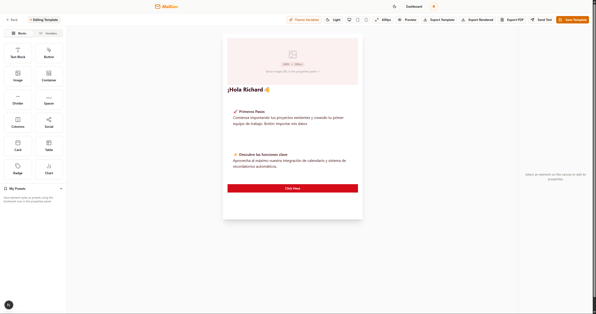
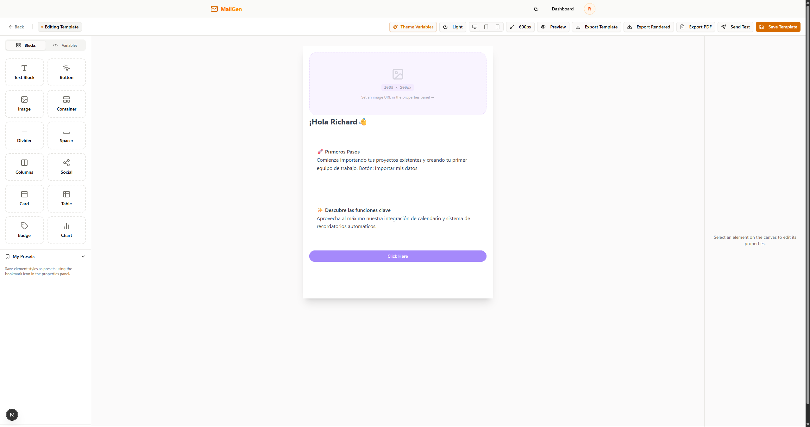

# MailGen — Email Template Builder

> **Work in progress.** Core editor is functional. Some features are still being built.

A visual drag-and-drop email template builder designed **by developers, for developers**. The key idea: paste your existing Shadcn/ui CSS variables directly into the editor and your brand colors, typography, and radius instantly apply to the entire email — so templates stay consistent with your app's design system across every project.

---

## The Problem It Solves

You already have a design system. You already have Shadcn CSS variables. But every time you need to send an email, you start from scratch with hardcoded colors that drift from your UI.

MailGen lets you reuse those variables — `--primary`, `--background`, `--foreground`, `--radius` — in email templates. Switch projects, paste your new variables, done.

### Two themes, same template

| Default theme | Custom theme |
|---|---|
|  |  |

---

## Features

### Available now
- **Drag-and-drop editor** — 13 block types: Text, Button, Image, Container, Divider, Spacer, Columns, Social, Card, Table, Badge, Chart, and Root layout
- **Shadcn CSS variable injection** — paste your `:root { ... }` block, see results instantly in the canvas
- **Multi-level undo/redo** — full history stack via Zustand + Immer
- **Responsive preview** — toggle between Desktop (600px), Tablet (480px), and Mobile (375px)
- **HTML export** — powered by `@react-email/components`, produces clean client-compatible HTML
- **JSON template export** — export/import the raw template tree
- **PDF export** — via html2canvas + jsPDF
- **Send test emails** — Resend API integration, rate-limited to 3 req/min
- **Element presets** — bookmark any configured block and drag it from the sidebar in future sessions
- **Template dashboard** — create, rename, duplicate, and delete templates, persisted to localStorage
- **Dark mode** — full light/dark support driven by Shadcn CSS variables

### Planned
- [ ] Template sharing via URL / export link
- [ ] Variable placeholders (`{{firstName}}`, `{{company}}`) with preview data
- [ ] More block types (Video thumbnail, Countdown, QR Code)
- [ ] Cloud persistence (replace localStorage with a real backend)
- [ ] Team workspaces
- [ ] CLI to scaffold templates into a project

---

## Shadcn CSS Variable Example

Paste any compatible `:root` block in the **Theme Variables** panel inside the editor:

```css
/* Theme A — warm brand */
:root {
  --background: hsl(0 0% 97%);
  --foreground: hsl(0 0% 11%);
  --primary: hsl(0 56% 40%);
  --primary-foreground: hsl(0 0% 100%);
  --secondary: hsl(42 91% 91%);
  --muted: hsl(20 30% 92%);
  --radius: 0.375rem;
  --font-sans: Poppins, sans-serif;
}

/* Theme B — cool brand */
:root {
  --background: hsl(220 20% 97%);
  --foreground: hsl(220 15% 10%);
  --primary: hsl(221 83% 53%);
  --primary-foreground: hsl(0 0% 100%);
  --secondary: hsl(210 40% 92%);
  --muted: hsl(210 20% 92%);
  --radius: 0.5rem;
  --font-sans: Inter, sans-serif;
}
```

The editor parses these and injects them as scoped CSS — the canvas, all block colors, borders, and typography update live.

---

## Tech Stack

| Layer | Technology |
|---|---|
| Framework | Next.js 16 (App Router, Turbopack) |
| UI | React 19, Tailwind CSS 4, Shadcn/ui (new-york) |
| State | Zustand 5 + Immer (editor, auth, theme, presets) |
| Server state | TanStack Query v5 |
| Drag-and-drop | dnd-kit |
| Email rendering | @react-email/components + @react-email/render |
| Charts | Recharts (SVG → data URI in export) |
| Email delivery | Resend |
| Forms + validation | TanStack Form + Zod 4 |
| Rate limiting | TanStack Pacer |
| Package manager | Bun |

---

## Getting Started

### Prerequisites

- [Bun](https://bun.sh) >= 1.0
- Node.js >= 20

### Install and run

```bash
git clone https://github.com/your-username/email-generator-template.git
cd email-generator-template

bun install
bun run dev
```

Open [http://localhost:3000](http://localhost:3000).

### Commands

```bash
bun run dev      # Start dev server (Next.js + Turbopack)
bun run build    # Production build
bun run start    # Start production server
bun run lint     # ESLint

npx shadcn add <component>   # Add a Shadcn component
```

### Environment variables

```env
# .env.local
# No required env vars for local development
# Templates are stored in localStorage by default

# Optional — only needed to use "Send Test" from the editor
RESEND_API_KEY=re_...
```

---

## Architecture

Hexagonal Architecture (Ports & Adapters) — strict 4-layer separation:

```
src/
├── domain/          # Pure types + repository interfaces — zero external deps
├── infrastructure/  # Concrete implementations (LocalStorage, Mock, API, React Query)
├── application/     # Business logic: services, Zustand stores, custom hooks
├── components/      # UI: organisms/, features/, ui/ (Shadcn), providers.tsx
├── config/          # services.ts — DI composition root
└── app/             # Next.js App Router: routes + API endpoints
```

### Template data model

The canvas state is a **flattened tree** stored in a dictionary — no nested objects, only ID references:

```typescript
TemplateData {
  rootNodeId: string
  nodes: Record<string, EditorNode>
}

EditorNode {
  id: string
  type: EditorNodeType   // ROOT | TEXT | BUTTON | IMAGE | ...
  props: Record<string, any>
  children: string[]
}
```

---

## Contributing

This project is in early development. Issues and PRs are welcome once the core feature set stabilizes.

---

## License

MIT
